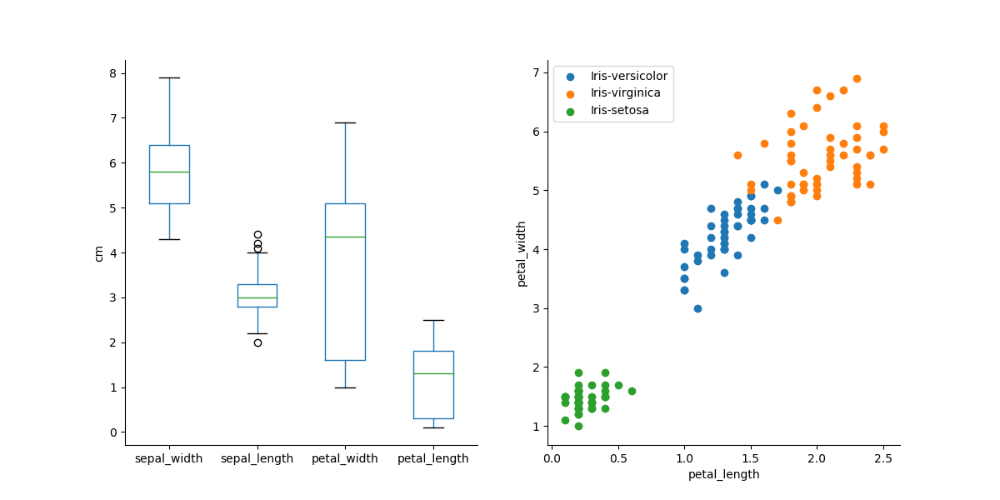
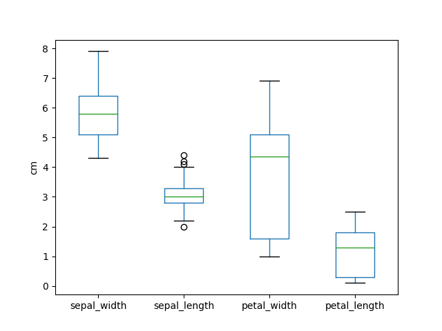
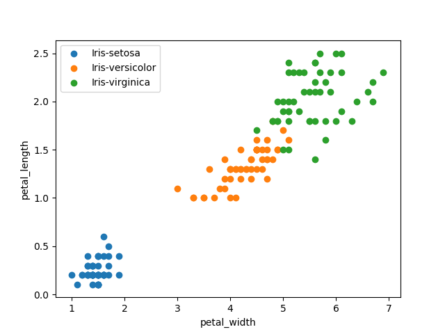

# libraries
This repository has the two major focuses:
1) Use matplotlib to plot distributions from iris.data from https://archive.ics.uci.edu/ml/datasets/iris.
2) Use numpy to write a matrix of chosen size with random numbers 
chosen from a uniform distribution in range (0, 1]

**Note**: This repository is more focused on providing and testing useful
functions regarding the above rather than providing already finished pipelines
for users. Any pipelines formed for functional testing are specific
to iris.data but can be edited for a user's desired function.

## System Requirements
The program relies on python (has only been tested with 3.6.13
but should work with any version of python3). Other required
packages are listed in the file environment.yml and can be
installed using conda (`conda install <library>`).
- matplotlib, numpy, pandas
- pycodestyle is only required to assess compatability with pep8
 

## Installation
You can clone this repository by picking a directory
in your terminal and typing `git clone <link (read below)>`

You can get this link by selecting "Code" and then copy the appropriate
link based on whether you are using a personal token (https) or SSH code.

## General Usage: plotter.py
Purpose: Plot data from iris.data
The current script makes the following png file from the iris.data
where users can choose the name of the file.



**Required Arguments:**

|Flag|Type|Description|
|----|----|----------|
|--png_name| \</path/to/File> | name of png to save the image as  <br> **NOTE: must end with png**</br>

**Example terminal usage:**
```
python plotter.py --test_combined.png
```

### Additional Functions available:
Currently, plotter.py contains 2 functions for plotting a boxplot
of a dataframe's columns and to plot a scatterplot comparing two
desired columns of a dataframe subsetted by a column for a color key. 

## General Usage: data_processor.py
### Functions available:
3 Functions are available in this file:
1. Make a matrix of a chosen size with floats sampled from
 a uniform distribution with range (0, 1]
2. Get the # rows & # columns in a comma separated file.
    - Note: This function assumes the file has an equal number of columns
    throughout UNLESS the row is not comma delimited in which case the row
    is ignored and a warning is provided
3. Write a matrix of a chosen size as described in 1 to a file of your chosen name.
### Example Usage:
A python and bash script using these functions are included in 
`tests/func_dataprocessing.py` and `tests/testdata_processor.sh`, 
respectively.

func_dataprocessing.py performs function 3 from above for the
iris.data set.

**Required Arguments:**

|Flag|Type|Description|
|----|----|----------|
|--num_rows| \int>0 | Number of desired rows <br> **NOTE: must be integer > 0!**</br>
|--num_cols  | \int>0   | Number of desired columns <br> **NOTE: must be integer > 0!**</br>

**Example terminal usage**
```
python func_dataprocessing.py --num_rows 4 --num_cols 5
```
File is saved as func.csv.

## Running
**Checking/Example**
Functional and unit tests are available under the tests directory.
Notably, these are automatically run using github actions whenever a
pull request or push is made to main.

Plotting:
- unit
    - test_plotter.py run with `python test_plotter.py`
        Expected output:
          
        
- functional
    - testplotter.sh run with `bash testplotter.sh`        

Data Processing:
- unit
    - test_data_processor.py run with `python test_data_processor.py`
        Expected output includes ex_written_file.csv in same directory
- functional
    - testdata_processor.sh run with `bash testdata_processor.sh`
    
All should run with all successes and passing. If not, please reclone the repository.


## Github automatic testing
- The yml files allow running of the functional, unit tests, and
ensuring all python code follows pycodestyle every time there is 
change in code committed to or pulled from the main branch.
They do not need to be used by the user *unless* you **fork** the 
repository or **pull** in which case you can look under actions in github
to ensure tests are passed.